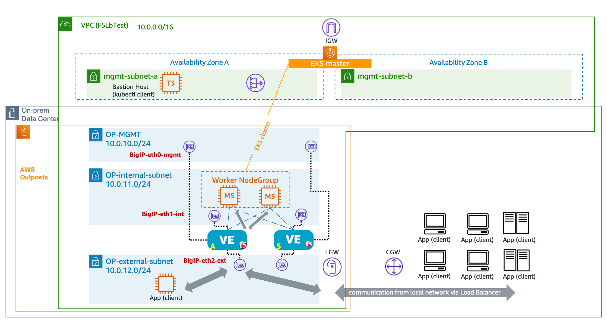

## Amazon-eks-with-f5lb-for-cnf

When a specific EKS application such as telecom network function (container-based network function: CNF) requires Layer4 load balancer in the Outposts environment or requires to support SCTP like protocols (which are not supported by AWS NLB), then F5 BIGIP load balacner can be an option to be used in EKS environment along with F5 CIS (Container Ingress Service) and FIC (F5 IP address management) modules. This repository is to provide some examples of deployment for F5 BIGIP VE LB on AWS environment, especially with being integrated to Amazon EKS to expose a service through Load Balacner to the outside of EKS clsuter. 

### Pre-requisite 

* User has to create a baseline VPC environment including public/private subnets and route tables associated to each subnet. 
* CloudFormation for F5 BIGIP Load Balancer can be retrieved from F5 Github repo (e.g. https://github.com/F5Networks/f5-aws-cloudformation/tree/main/supported/failover/same-net/via-api/3nic/existing-stack/payg). 
* F5 FIC requires RWO PVC that can be created with EBS and EBS CSI driver. This can be referred to https://aws.amazon.com/premiumsupport/knowledge-center/eks-persistent-storage/

### Installation Steps

* Please refer to AWS blog (link TBD) for detail.
* Rune the CloudFormation for BIGIP instantiation. 
* Configuring CFE for high-availability according to the environment. 
* Deploy CIS and FIC (kubectl).
* Service type=loadbalancer or TransportServer creation for EKS cluster. 

## Security

See [CONTRIBUTING](CONTRIBUTING.md#security-issue-notifications) for more information.

## License

This library is licensed under the MIT-0 License. See the LICENSE file.

